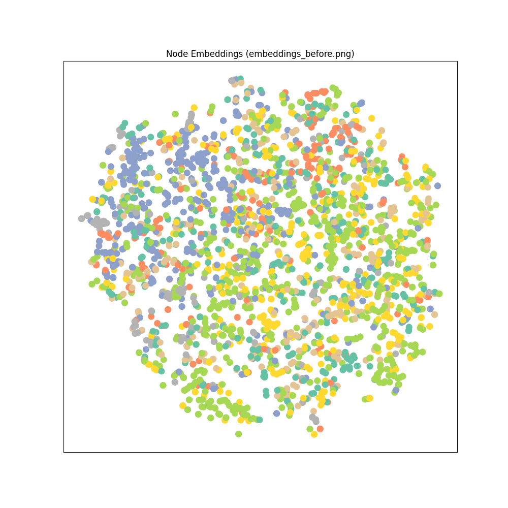
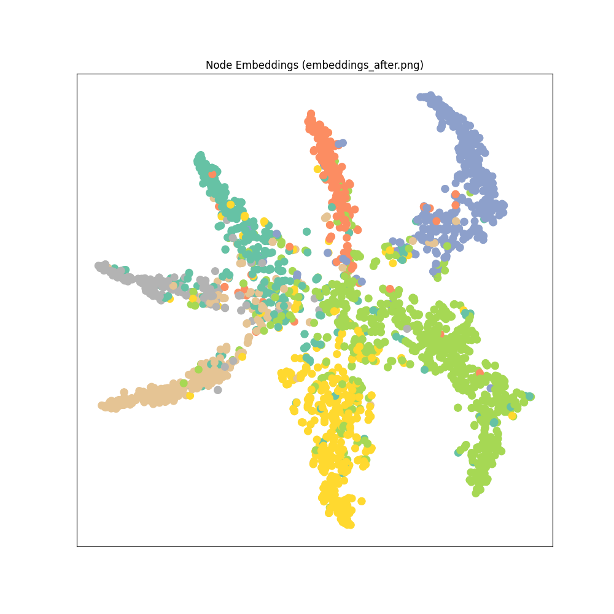

# GNN Node Classification: GCN on Cora

This repository provides a clean and modular implementation of **Graph Convolutional Networks (GCN)** for the node classification task using the **Cora** dataset. This project is designed for both academic research and self-learning purposes.

## Overview
The goal is to predict the category of scientific papers (nodes) in a citation network based on:
1.  **Node Features**: Sparse bag-of-words representation of papers.
2.  **Graph Structure**: Citation links between papers.

## Mathematical Background
The Graph Convolutional Network (GCN) introduced by Kipf & Welling (2017) utilizes a first-order approximation of spectral graph convolutions.

### 1. Graph Representation
A graph is represented as $G = (V, E)$, where:
*   $A \in \{0, 1\}^{N \times N}$ is the **Adjacency Matrix**.
*   $D$ is the **Degree Matrix**, where $D_{ii} = \sum_j A_{ij}$.
*   $X \in \mathbb{R}^{N \times F}$ is the **Feature Matrix** containing $F$-dimensional features for $N$ nodes.

### 2. GCN Propagation Rule
To include information from the node itself, we add self-loops to the adjacency matrix:
$$\tilde{A} = A + I_N$$
where $I_N$ is the identity matrix. The corresponding degree matrix is $\tilde{D}_{ii} = \sum_j \tilde{A}_{ij}$.

The layer-wise propagation rule is defined as:
$$H^{(l+1)} = \sigma \left( \tilde{D}^{-1/2} \tilde{A} \tilde{D}^{-1/2} H^{(l)} W^{(l)} \right)$$
*   $H^{(l)}$ is the activation matrix at layer $l$ ($H^{(0)} = X$).
*   $W^{(l)}$ is a trainable weight matrix.
*   $\sigma(\cdot)$ is an activation function (e.g., ReLU).
*   $\tilde{D}^{-1/2} \tilde{A} \tilde{D}^{-1/2}$ is the **Symmetric Normalized Adjacency Matrix**, which prevents numerical instability and exploding/vanishing gradients.

### 3. Node-level Message Passing
The matrix operation can be viewed as an aggregation of neighbor features:
$$h_i^{(l+1)} = \sigma \left( \sum_{j \in \mathcal{N}(i) \cup \{i\}} \frac{1}{\sqrt{\tilde{d}_i \tilde{d}_j}} h_j^{(l)} W^{(l)} \right)$$
where $\mathcal{N}(i)$ is the set of neighbors of node $i$.

## Training Process & Results
The model was trained for **200 epochs** using the Adam optimizer.

### Execution Log
```text
학습 전 초기 임베딩 시각화 중...
시각화 결과가 embeddings_before.png에 저장되었습니다.
Epoch 000, Loss: 1.9455
Epoch 020, Loss: 0.2433
Epoch 040, Loss: 0.0522
Epoch 060, Loss: 0.0401
Epoch 080, Loss: 0.0356
Epoch 100, Loss: 0.0396
Epoch 120, Loss: 0.0426
Epoch 140, Loss: 0.0455
Epoch 160, Loss: 0.0296
Epoch 180, Loss: 0.0304
Epoch 200, Loss: 0.0317
Accuracy: 0.8030
시각화 결과가 embeddings_after.png에 저장되었습니다.
```

### Final Performance
*   **Test Accuracy**: **80.30%**
*   **Analysis**: The final accuracy of 80.3% aligns with the benchmarks of the original GCN paper (81.5%).

## Visualization (t-SNE)
### 1. Before Training (`embeddings_before.png`)


### 2. After Training (`embeddings_after.png`)


## Project Structure
*   `model.py`: Definition of the 2-layer GCN architecture.
*   `train.py`: Main script for data loading, training loop, and evaluation.
*   `visualize.py`: Utility to project high-dimensional embeddings into 2D space using **t-SNE**.
*   `requirements.txt`: List of dependencies.

## Getting Started
### Installation
```bash
pip install -r requirements.txt
```

### Running the Project
```bash
python train.py
```
